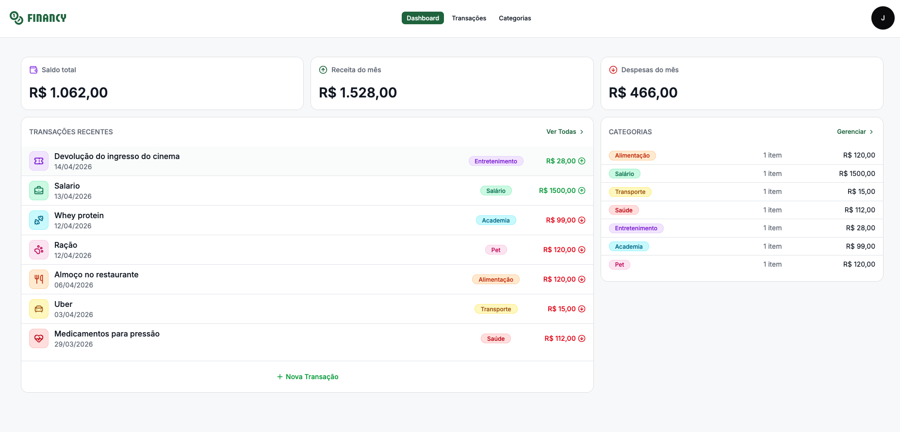
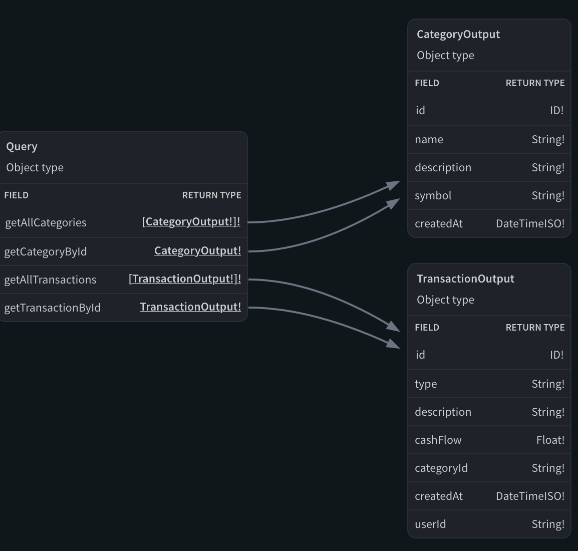

# Financy

Personal finance manager — track your income, expenses, and categories through a GraphQL API consumed by a React SPA.

---

## Project structure

```
financy/
├── backend/    # GraphQL API — Apollo Server + Prisma + SQLite
└── frontend/   # React SPA — Vite + TailwindCSS + TanStack Query
```

Each folder has its own `README.md` with setup instructions and API/UI details.

---

## How they connect

```
┌─────────────────────┐          GraphQL over HTTP          ┌──────────────────────────┐
│                     │  ─────────────────────────────────► │                          │
│  Frontend           │  POST http://localhost:4000/graphql  │  Backend                 │
│  localhost:5173     │ ◄─────────────────────────────────  │  localhost:4000/graphql  │
│                     │          JSON response               │                          │
└─────────────────────┘                                      └──────────────────────────┘
```

1. The frontend sends all data requests as **GraphQL mutations and queries** to the backend endpoint.
2. The backend validates the **JWT token** from the `Authorization: Bearer <token>` header on every protected resolver.
3. The token is obtained from the `login` or `register` mutation and stored in the frontend via Zustand.
4. Prisma reads and writes to a local **SQLite** database.

---

## Getting started

### 1. Backend

```bash
cd backend
npm install
npx prisma migrate dev
npm run dev
```

Runs at `http://localhost:4000/graphql`.

### 2. Frontend

```bash
cd frontend
pnpm install
pnpm dev
```

Runs at `http://localhost:5173`.

> Start the backend first — the frontend will fail to fetch data without it.

---

## Features

- **Auth** — register and login with JWT-based session
- **Transactions** — create, edit, delete, and filter income/expense entries
- **Categories** — organize transactions with custom icons and labels
- **Dashboard** — summary of balance and spending by category

---

## Preview

### Dashboard



### GraphQL schema


