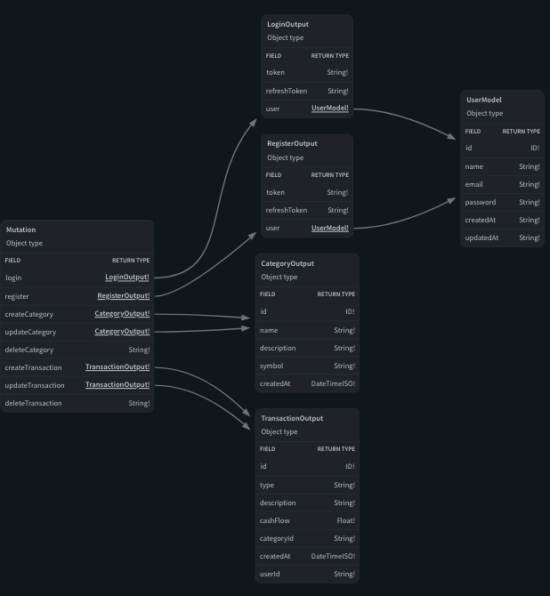

# Financy — Backend

GraphQL API built with **Node.js**, **Apollo Server**, **type-graphql**, and **Prisma** (SQLite). Handles authentication, categories, and financial transactions.

---

## Stack

- **Runtime** — Node.js + TypeScript
- **Server** — Express + Apollo Server v4
- **GraphQL** — type-graphql (code-first schema)
- **ORM** — Prisma with SQLite
- **Auth** — JWT (Bearer token via Authorization header)

---

## Schema

### Queries


<video src="images/Queries.mp4" controls width="100%"></video>

| Query | Description | Auth required |
|---|---|---|
| `getAllTransactions` | Returns all transactions for the logged-in user | Yes |
| `getTransactionById(transactionId)` | Returns a single transaction by ID | Yes |
| `getAllCategories` | Returns all categories for the logged-in user | Yes |
| `getCategoryById(categoryId)` | Returns a single category by ID | Yes |

---

### Mutations



<video src="images/Mutations.mp4" controls width="100%"></video>

| Mutation | Description | Auth required |
|---|---|---|
| `register(data)` | Creates a new user account | No |
| `login(data)` | Authenticates and returns a JWT token | No |
| `createTransaction(data)` | Creates a new transaction | Yes |
| `updateTransaction(data)` | Updates an existing transaction | Yes |
| `deleteTransaction(transactionId)` | Deletes a transaction by ID | Yes |
| `createCategory(data)` | Creates a new category | Yes |
| `updateCategory(data)` | Updates an existing category | Yes |
| `deleteCategory(categoryId)` | Deletes a category by ID | Yes |

---

## Getting started

```bash
# Install dependencies
npm install

# Set up the database
npx prisma migrate dev

# Start the dev server
npm run dev
```

Server runs at `http://localhost:4000/graphql`.

---

## Environment variables

Create a `.env` file at the root of the backend folder:

```env
DATABASE_URL="file:./dev.db"
JWT_SECRET="your-secret-here"
```

---

## Authentication

Protected resolvers expect a JWT token in the `Authorization` header:

```
Authorization: Bearer <token>
```

The token is returned from the `login` and `register` mutations.
